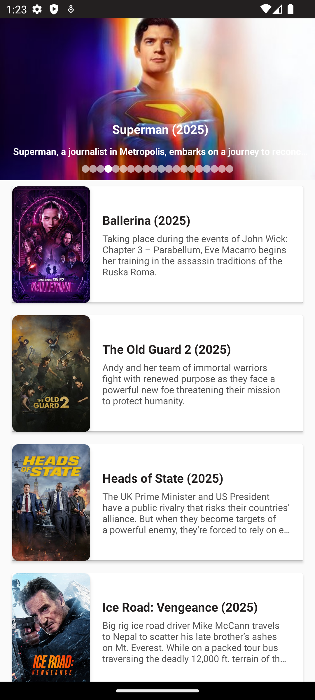
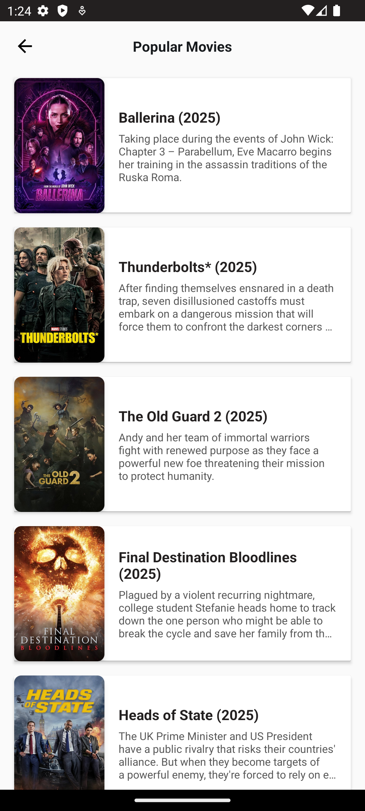

# 🎬 MovieListApp

**MovieListApp** is a Android application designed to list current popular movies. Built using clean architecture principles, it leverages contemporary Android development tools such as MVVM, Hilt, Retrofit, and Kotlin Coroutines.

  
  
  

---

## 🛠️ Tech Stack & Libraries

- **Kotlin** – Modern and expressive programming language
- **MVVM Architecture** – With `ViewModel` and `LiveData`
- **Hilt** – Dependency Injection framework
- **Retrofit** – For network and RESTful API communication
- **Glide** – Image loading and caching
- **Navigation Component** – Seamless navigation between screens
- **Kotlin Coroutines** – Asynchronous and reactive data handling
- **ViewBinding** – Type-safe and performant view binding

---

## 🚀 Features

- 🎞️ Browse popular movies
- 📜 View detailed movie information
- 🔄 Swipe-to-refresh functionality
- 🔐 API configuration via `BuildConfig` variables (`API_KEY`, `BASE_URL`, `IMAGE_URL`)

---

## 📱 Requirements

- Minimum SDK: 21
- Target SDK: 33

## ‍💻 Author

Mert Çalışkan